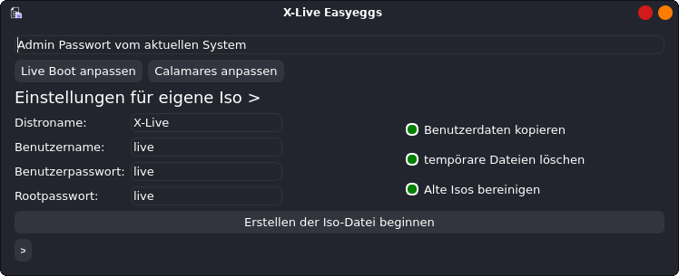

# X-Live easyeggs

Eine grafische Vereinfachung als Erweiterung für Penguins Eggs. 
Erstellen Sie schnell und einfach Debian-basierte modifizierte Linux-ISOs.

Getestet auf:
- Debian 12 Xfce
- Xubuntu 24.04
- Kubuntu 24.04 install mit Calamares klappt nicht immer
- Linux Mint 21.3 Cinnamon und xfce 

A graphical simplification as an extension for Penguins Eggs
Quickly and easily create Debian based modified Linux ISOs.

tested on:
- Debian 12 Xfce
- Xubuntu 24.04
- Kubuntu 24.04 install with Calamares does not always work
- Linux Mint 21.3 Cinnamon und xfce

---

